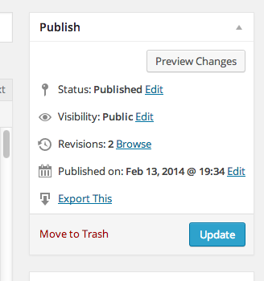

# Export One Post

Works on pages and custom post types!




Confirmed working on WordPress 5.4.1, single and multisite. Gutenberg not (yet...?) supported.

## WP-CLI

**There is a core command, this plugin is *not* required.**

```
wp export --post__in=123
```