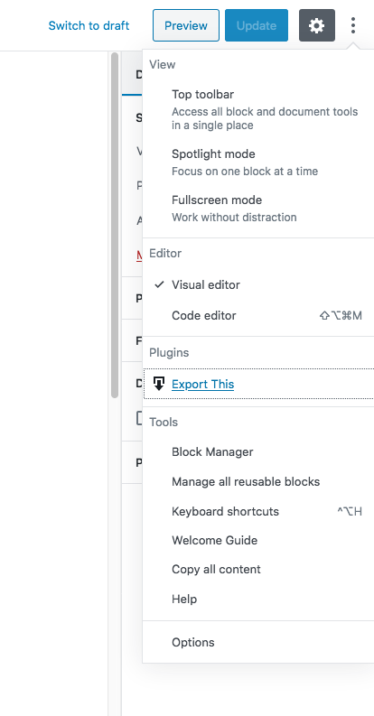
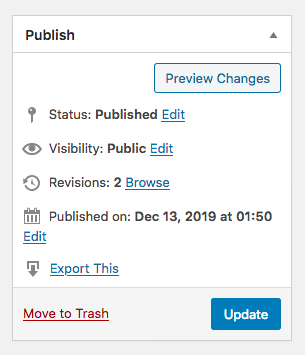
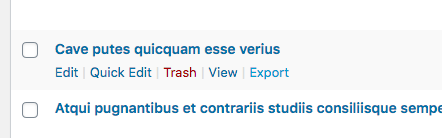

# Export One Post

Works on pages and custom post types!

In the Block Editor, the option can be found under the *kebab* menu:



In the Classic Editor, the option can be found in the Publish box:



And in the row actions for quick access:




Confirmed working as of WordPress 5.4.1, single and multisite. 

## WP-CLI

**There is a core command, this plugin is *not* required.**

```
wp export --post__in=123
```